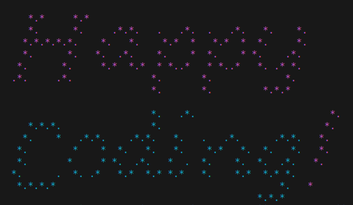

# ThousandStars

ThousandStars is a typeface I created for my school projects at kood/Jõhvi.

## Usage

The `thousandstars.txt` file contains ASCII characters ranging from `' '` to `'~'`. Each character is represented by 8 lines, and characters are separated by an empty line.

Feel free to use ThousandStars in your projects, and don't forget to give credit!

### How To Use

To use ThousandStars in your ASCII art or web projects:

1. Download the Font: Clone this repository or download the thousandstars.txt file.

2. Integrate into Your Project

3. Give Credit:
    - If you find ThousandStars useful, please provide credit in your project documentation or credits section.

## License

ThousandStars is provided under the MIT license. See the [LICENSE](LICENSE) file for details.

## Contribution

Feel free to contribute by suggesting improvements, reporting issues, or creating pull requests.
